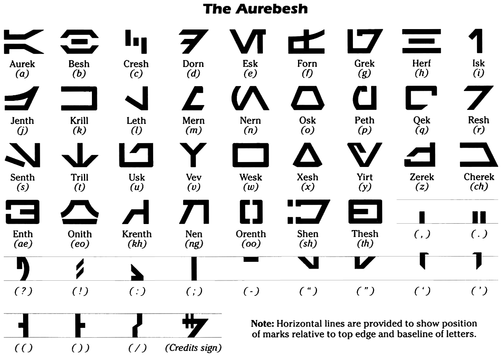

# aurebesh
DL model that classifies handwritten Star Wars characters (Aurebesh -> Latin character set).

A notebook utilizes transfer learning to classify handwritten Aurebesh into one of 26 different characters. 
Aurebesh is the character set used in the Star Wars universe. (https://starwars.fandom.com/wiki/Aurebesh) Each 
character translates to a Latin character. Aurebesh is a contraction of Aurek Besh which literally means "A, B". 
A typeset version of Aurebesh is below, along with the corresponding Latin characters. For this project, the classifier 
only works on the 26 characters that have an equivelant to the English alphabet, omitting special characters and 
characters that aren't found in the alphabet such as Cherek or Onith.

The source of the handwritten characters is from Omniglot https://github.com/brendenlake/omniglot
